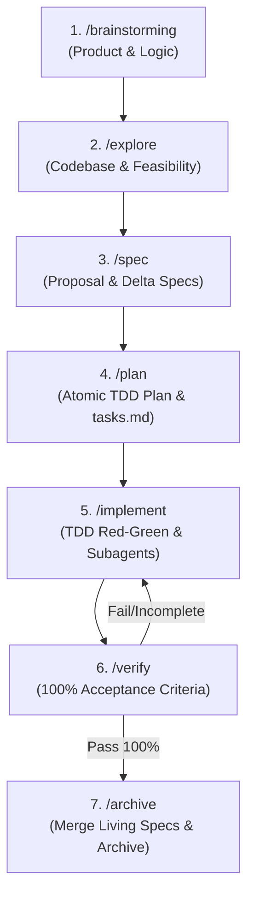

# Thiết Kế Tích Hợp OpenSpec (Fission-AI) & Superpowers trong Open-Power

## 1. Mục tiêu & Triết lý
Kết hợp kỷ luật thực thi kỹ thuật của **Superpowers** (TDD Red-Green, Subagents, Phản biện Socratic) với khả năng quản lý vòng đời tài liệu của **OpenSpec** (Living Specs, Active Changes, Delta Specs, Archive) thành một hệ sinh thái duy nhất.

---

## 2. Chu Trình Phát Triển 6 Bước (End-to-End Lifecycle)



---

## 3. Cấu Trúc Không Gian Làm Việc (`.opow/`)

```text
.opow/
├── specs/                          # LIVING SPECS (Source of Truth của hệ thống theo domain)
│   ├── auth/spec.md
│   └── payment/spec.md
├── changes/                        # ACTIVE CHANGES (Các tính năng đang phát triển)
│   └── <change-id>/
│       ├── proposal.md             # Động lực, phạm vi & User Intent
│       ├── design.md               # Kiến trúc & Thiết kế kỹ thuật
│       ├── tasks.md                # Checklist công việc thực thi
│       └── specs/                  # Delta Specs (ADDED / MODIFIED / REMOVED)
│           └── <domain>.spec.md
├── archive/                        # COMPLETED HISTORY (Lịch sử các change đã hoàn tất)
│   └── <change-id>/
└── templates/                      # MẪU CHUẨN
    ├── proposal.md
    ├── design.md
    ├── tasks.md
    ├── delta.spec.md
    └── living.spec.md
```

---

## 4. Danh Mục Skills & Workflows

### A. Skills
| Skill | Hành động | Trách nhiệm |
| :--- | :--- | :--- |
| **`brainstorming`** | *Giữ nguyên* | Đào sâu ý tưởng nghiệp vụ, phản biện Socratic, kiểm soát rủi ro và Hard-Gates. |
| **`openspec-explore`** | 🟢 **Thêm mới** | Quét codebase, kiểm tra điểm chạm, phân tích dependency, chuẩn bị input cho Delta Specs. |
| **`spec-driven-development`** | 🟡 **Cập nhật** | Hướng dẫn định dạng Delta Spec (`ADDED`, `MODIFIED`, `REMOVED`), vòng đời Propose ➔ Apply ➔ Archive. |
| **`writing-plans` / `executing-plans`** | 🟡 **Cập nhật** | Đồng bộ trực tiếp với `tasks.md` của OpenSpec và phân rã các bước TDD nhỏ. |
| **`test-driven-development`** | *Giữ nguyên* | Viết failing test trước khi viết code cho từng task trong `tasks.md`. |
| **`verification-before-completion`** | 🟡 **Cập nhật** | Xác thực toàn bộ Acceptance Criteria của Delta Spec trước khi cho phép Archive. |

### B. Workflows (Slash Commands cho AI Assistants)
| Command | Mục đích | Kỹ năng AI kích hoạt ngầm |
| :--- | :--- | :--- |
| **`/explore`** | Khảo sát kỹ thuật & codebase trước khi đề xuất thay đổi. | `openspec-explore` |
| **`/spec`** | Khởi tạo thư mục change `.opow/changes/<id>/` với proposal và delta specs. | `brainstorming` + `spec-driven-development` |
| **`/plan`** | Lập kế hoạch chi tiết và chia nhỏ checklist vào `tasks.md`. | `writing-plans` |
| **`/implement`** | Thực thi code theo checklist `tasks.md`. | `test-driven-development` + `subagent-driven-development` |
| **`/verify`** | Kiểm thử độc lập và đối chiếu Acceptance Criteria. | `verification-before-completion` + `systematic-debugging` |
| **`/archive`** | Hợp nhất Delta Specs vào `.opow/specs/` và chuyển change vào `.opow/archive/`. | `spec-driven-development` (Archive Routine) |

---

## 5. Danh Sách Tệp Triển Khai Trong `open-power`

1. **Templates mới (`src/templates/openspec/templates/`)**:
   * `proposal.md`, `design.md`, `tasks.md`, `delta.spec.md`, `living.spec.md`.
2. **Workflows mới & cập nhật (`src/templates/workflows/`)**:
   * Thêm `explore.md`, `archive.md`.
   * Cập nhật `spec.md`, `plan.md`, `implement.md`, `verify.md`.
3. **Skills mới & cập nhật (`src/skills/`)**:
   * Thêm `src/skills/openspec-explore/SKILL.md`.
   * Cập nhật `src/skills/spec-driven-development/SKILL.md`.
4. **Cài đặt & Scaffolding (`src/commands/install.js`)**:
   * Khởi tạo cấu trúc `.opow/specs/`, `.opow/changes/`, `.opow/archive/`, `.opow/templates/`.
5. **Wrappers & Documentation**:
   * Cập nhật `src/wrapper/` (Cline, Antigravity, Claude Code, Codex).
   * Cập nhật `README.md`.
