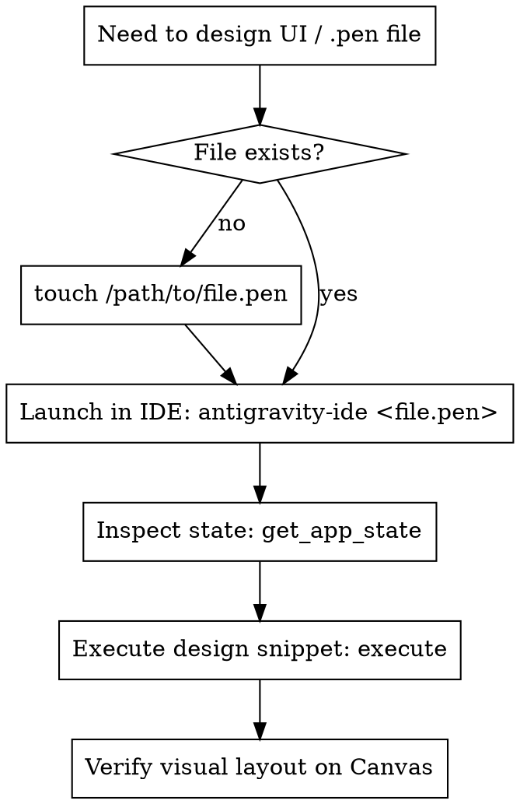

# Designing with Pencil

## Overview

The Pencil MCP allows automated creation, inspection, and modification of `.pen` design files (web/mobile apps, design systems, and components).

`.pen` files are encrypted and managed by the Pencil IDE extension. Interacting with them requires an active editor tab on the canvas.

## Automated Workflow

To create or modify designs automatically:



### Step 1: Ensure File Exists & Active in Editor

The Pencil extension requires the `.pen` file to be open in an active tab:

```bash
# 1. Create file if not existing
touch /Volumes/KIOXIA/Projects/open-power/designs/my-screen.pen

# 2. Automatically open & focus the canvas tab in Antigravity IDE
"/Applications/Antigravity IDE.app/Contents/Resources/app/bin/antigravity-ide" /Volumes/KIOXIA/Projects/open-power/designs/my-screen.pen
```

### Step 2: Execute Design Code

Execute JavaScript snippets using the `execute` tool against the active `.pen` file.

#### Example Execution via stdio JSON-RPC:

```javascript
node -e '
const cp = require("child_process");
const proc = cp.spawn("/Users/alex/.pencil/mcp/antigravity_ide/out/mcp-server-darwin-arm64", ["--app", "antigravity_ide"]);

const initMsg = JSON.stringify({jsonrpc: "2.0", id: 1, method: "initialize", params: {protocolVersion: "2024-11-05", capabilities: {}, clientInfo: {name: "agent", version: "1.0"}}});
const execMsg = JSON.stringify({
  jsonrpc: "2.0",
  id: 2,
  method: "tools/call",
  params: {
    name: "execute",
    arguments: {
      filePath: "/Volumes/KIOXIA/Projects/open-power/designs/my-screen.pen",
      input: `
const pos = FindEmptySpace({width: 800, height: 600, padding: 40});
const screenId = Insert(document, {type: "frame", name: "App Screen", x: pos.x, y: pos.y, width: 800, height: 600, fill: "#0F172A", cornerRadius: 16, layout: "vertical", padding: 24, gap: 16, placeholder: true});

// Header
const header = Insert(screenId, {type: "frame", name: "Header", width: "fill_container", layout: "horizontal", justifyContent: "space-between", alignItems: "center"});
Insert(header, {type: "text", name: "Title", fontFamily: "Inter", fontSize: 22, fontWeight: "bold", fill: "#FFFFFF", content: "Dashboard Overview"});

Update(screenId, {placeholder: false});
`
    }
  }
});

proc.stdin.write(initMsg + "\n");
setTimeout(() => proc.stdin.write(execMsg + "\n"), 400);
setTimeout(() => proc.kill(), 2500);
'
```

## DSL & Schema Reference

### 1. Operations

| Function | Description | Example |
|----------|-------------|---------|
| `FindEmptySpace({width, height, padding, direction})` | Finds empty canvas space | `const pos = FindEmptySpace({width: 800, height: 600, padding: 40});` |
| `Insert(parent, nodeData)` | Inserts a new node | `const card = Insert(parent, {type: "frame", layout: "vertical"});` |
| `Update(nodeId, updateData)` | Updates existing node properties | `Update(card, {placeholder: false});` |
| `Copy(nodeId, parent, options)` | Duplicates existing node | `const clone = Copy(cardId, document, {x: pos.x, y: pos.y});` |
| `Delete(nodeId)` | Deletes a node | `Delete(oldCardId);` |
| `SetVariables(vars)` | Defines design token variables | `SetVariables({"primary": {type: "color", value: "#3B82F6"}});` |

### 2. Layout & Styling Rules

* **Flexbox Layout**: Use `layout: "horizontal"` or `"vertical"` on frames.
* **Dynamic Sizing**: Prefer `width: "fill_container"` or `"fit_content"` instead of hardcoded numbers.
* **Alignment values**: `alignItems` and `justifyContent` accept `"start"`, `"center"`, `"end"`, `"space-between"`. (Do **NOT** use `"baseline"`).
* **Text Visibility**: Text nodes **must** define `fill` (e.g. `fill: "#FFFFFF"`), otherwise they are invisible.
* **Multi-line Text**: Set `textGrowth: "fixed-width"` and `width: "fill_container"` when text should wrap.
* **Placeholder Pattern**: Root containers **must** be created with `placeholder: true`, and unset with `Update(screenId, {placeholder: false})` once children are inserted.

## Common Mistakes & Solutions

| Issue | Cause | Fix |
|-------|-------|-----|
| `Failed to access file "undefined"` | No `.pen` canvas tab is active in IDE | Run `antigravity-ide <path/to/file.pen>` to focus tab |
| `alignItems expected one of: "start", "center", "end"` | Used invalid CSS value like `"baseline"` | Use `"center"` or `"start"` |
| Text is not visible on canvas | Missing `fill` attribute on text node | Always supply `fill: "#HEX"` on text |
| Duplicate ID conflicts | Re-running snippet with hardcoded IDs | Rely on returned IDs from `Insert()` / variables |
